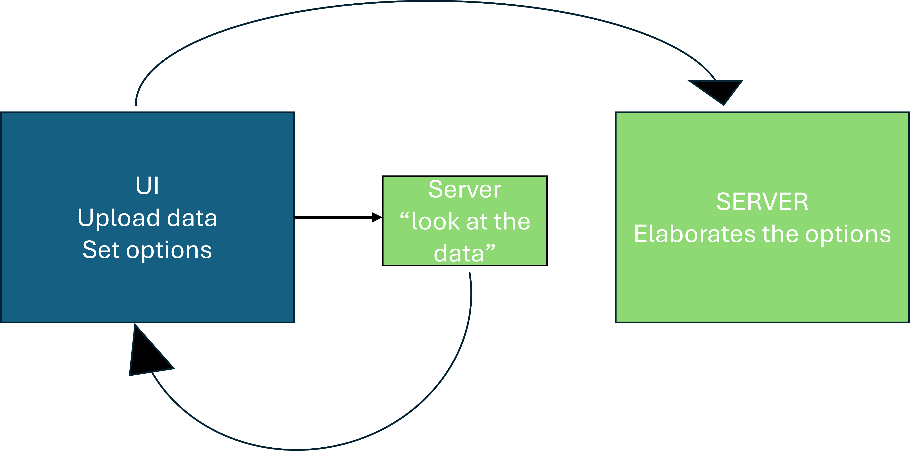
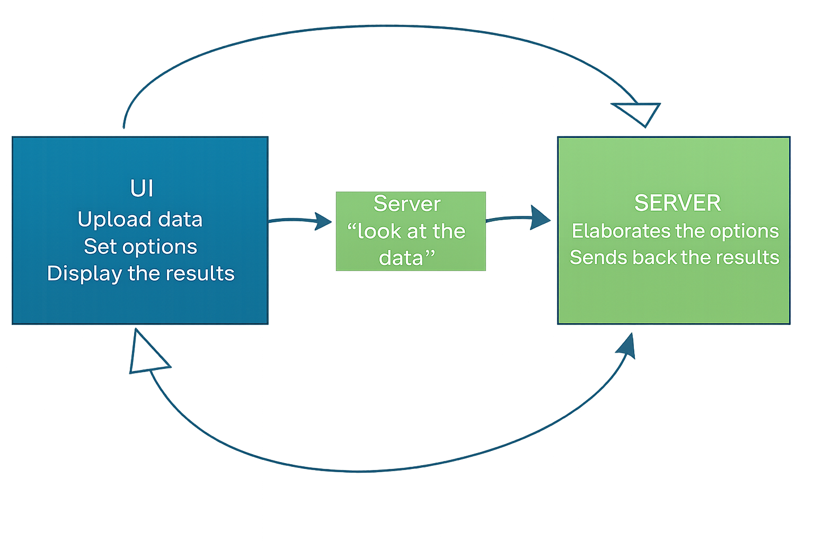

```{r}
#| include: false
library(emoji)
```

## 

People want to use the app for their own data -- the code needs to be as fluid as possible and to allow the users to upload their data 


```{r}
#| echo: true
fileInput("file", "Select a CSV file", accept = "csv")
```


. . . 

To be flexible enough to allow for the customization of the settings based on the characteristics of the dataset

The UI and the server need to communicate differently


## A flow in a flow

:::{.r-stack}

:::{.fragment .fade-in-then-out}
{width="450" height="300" fig-aling="center"}
:::

:::{.fragment .fade-in-then-out}
{width="450" height="300" fig-aling="center"}
:::

:::{.fragment .fade-in-then-out}
{width="450" height="300" fig-aling="center"}
:::

:::{.fragment .fade-in-then-out}
{width="450" height="300" fig-aling="center"}
:::

:::

## {.smaller}

::: {.panel-tabset}

## UI 

```{r}
#| echo: true
#| eval: false
#| code-line-numbers: "|4-7|8|9-10|11"
ui = fluidPage(
  sidebarLayout(
    sidebarPanel(
        fileInput("file", "", accept = c("csv")), # <1>
        radioButtons("sep",                          # <2>
                     "Choose column separator",      #  <2>
                     c(";" = ";", "," = ",")),      # <2>
      actionButton("load", "Upload data"),         # <3>                
      uiOutput("x_ui"),  # <4>
      uiOutput("y_ui"),  # <4>
 actionButton("analyze", "Analyze data")   # <5>
    ),
    
    mainPanel(
      plotOutput("graph"),
      verbatimTextOutput("summary")
    )
  )
)
```


1. File input
2. Specify the separator to be used in the read.csv function
3. First action button to upload the dataset
4. Define the UI container for the names of the dataset variables, taken from the dataset itself
5. Second button that actually activates the selection of the selected columns and starts the analysis

## Server 


```{r}
#| echo: true
#| eval: false
#| code-line-numbers: "|1|2-4|5-7|8-15|16-23|25-28|"
server <- function(input, output, session){
  dataInput <- eventReactive(input$load, {  # <1>
      read.csv(input$file$datapath, sep = input$sep) # <1>
  }) # <1>
  vars <- reactive({    # <2>
    names(dataInput())  # <2>
  })                    # <2>
  output$x_ui <- renderUI({ # <3> 
    selectInput(   # <3> 
      "x",         # <3> 
      "X variable:",  # <3> 
      choices = vars(), # <3> 
      selected = vars()[1]  # <3> 
    )                  # <3> 
  }) # <3>
  output$y_ui <- renderUI({ # <4>
    selectInput(           # <4>
      "y",                  # <4>
      "Y variable:",       # <4>
      choices = vars(),    # <4>
      selected = vars()[min(2, length(vars()))] # <4>
    )                     # <4>  
  }) # <4>
  
  newdata <- eventReactive(input$analyze, {  # <5>
    df <- dataInput()                        # <5>
    df[, c(input$x, input$y), drop = FALSE]  # <5>
  })   #<5>
  # <5>
  output$graph <- renderPlot({
    df <- newdata()   
    x <- df[[1]]
    y <- df[[2]]
    if (is.factor(x) || is.character(x)) {
      boxplot(y ~ x,
              xlab = "Group",
              ylab = "Value")
    } else {
      plot(x, y)
    }
  })
  output$summary <- renderPrint({
    df <- newdata()
    summary(df)
  })
}
```

1. Define the reactive environment and import the correct dataset with the dedicated function
2. Extract the column names to populate the ui setting configuration 
3. Use the renderUI to actually populate the response options of the x variable
4. Use the renderUI to actually populate the response options of the y variable
5. Select the columns of the dataframe that are actually used for the analysis

## Together

```{r}
#| echo: true
#| eval: false
shinyApp(ui, server)
```


:::

## 

```{r}
#| panel: sidebar

fileInput("file", "", accept = c("csv")) 
radioButtons("sep",  "Choose column separator",      
                     c(";" = ";", "," = ","))   

actionButton("load", "Upload data")                                      
uiOutput("x_ui")  
uiOutput("y_ui") 
      
actionButton("analyze", "Analyze data")  

```


```{r out.width="30%"}
#| panel: fill
 plotOutput("graph" )
verbatimTextOutput("summary")

```


```{r}
#| context: server
dataInput <- eventReactive(input$load, { 
      read.csv(input$file$datapath, sep = input$sep) 
  }) 
vars <- reactive({  names(dataInput()) })                    
output$x_ui <- renderUI({ 
    selectInput(   
      "x",         
      "X variable:",  
      choices = vars(), 
      selected = vars()[1]  
    )                  
  })
output$y_ui <- renderUI({ 
    selectInput(           
      "y",                 
      "Y variable:",       
      choices = vars(),    
      selected = vars()[min(2, length(vars()))] 
    )                   
  }) 
  
newdata <- eventReactive(input$analyze, {  
    df <- dataInput()                       
    df[, c(input$x, input$y), drop = FALSE] 
  })  
output$graph <- renderPlot({
    df <- newdata()   
    x <- df[[1]]
    y <- df[[2]]
    if (is.factor(x) || is.character(x)) {
      boxplot(y ~ x,
              xlab = "Group",
              ylab = "Value")
    } else {
      plot(x, y)
    }
  })
output$summary <- renderPrint({
    df <- newdata()
    summary(df)
  })
```